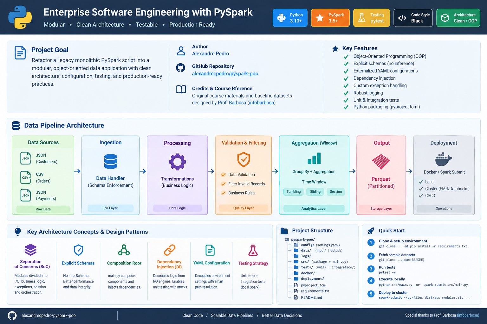

# Enterprise Software Engineering with PySpark

<p align="center">
  
</p>

[](https://www.python.org/)
[](https://spark.apache.org/)
[](https://docs.pytest.org/)
[](https://github.com/psf/black)
[](#key-architecture-concepts--design-patterns)

**Author:** Alexandre Pedro  
**GitHub Repository:** [alexandrecpedro/pyspark-poo](https://github.com/alexandrecpedro/pyspark-poo)  
**Credits & Course Reference:** Original course materials and baseline datasets designed by [Prof. Barbosa](https://github.com/infobarbosa) ([infobarbosa/pyspark-poo](https://github.com/infobarbosa/pyspark-poo)).

---

## Table of Contents

- [Executive Summary](#executive-summary)
- [Architecture Overview](#architecture-overview)
- [Key Architecture Concepts \& Design Patterns](#key-architecture-concepts--design-patterns)
- [Project Directory Structure](#project-directory-structure)
- [Quick Start \& Environment Setup](#quick-start--environment-setup)
- [Automated Testing Suite](#automated-testing-suite)
- [Packaging \& Cluster Deployment (`--py-files`)](#packaging--cluster-deployment---py-files)
- [Local Execution \& Output Inspection](#local-execution--output-inspection)
- [Acknowledgments \& Credits](#acknowledgments--credits)

---

## Executive Summary

Data pipelines written in PySpark often start as monolithic scripts designed for ad-hoc analysis or exploratory data science. However, when transitioning to production, procedural scripts become difficult to maintain, test, and scale.

This repository serves as an enterprise-grade software engineering project refactoring a **legacy monolithic PySpark script** into a modular, Object-Oriented Programming (OOP) data application. It demonstrates clean architecture, explicit schema enforcement, custom exception handling, externalized YAML configurations, dependency injection, robust logging, automated unit and integration testing, and modern Python package distribution (`pyproject.toml`).

---

## Architecture Overview


---

## Key Architecture Concepts & Design Patterns

* **Separation of Concerns (SoC):** Modules are strictly divided into I/O Data Handlers, Core Business Logic/Transformations, Exception Management, Session Factories, and Pipeline Orchestration.
* **Explicit Schemas vs. Schema Inference:** Complete elimination of performance bottlenecks and silent data corruption caused by runtime `inferSchema` scans.
* **Composition Root Pattern:** The entry point (`main.py`) acts as the sole composer, instantiating concrete components and injecting dependencies into the pipeline engine.
* **Dependency Injection (DI):** Decoupling processing logic from I/O engines to enable effortless unit testing with mock PySpark DataFrames.
* **Externalized Configuration:** Utilizing YAML files with smart path resolution (`next()` fallback mechanisms) to decouple environment configurations from code execution.
* **Granular Testing Strategy:** Divided into isolated **Unit Tests** for individual transformations/components and **Integration Tests** for full pipeline execution using local Spark instances.

---

## Project Directory Structure

```text
pyspark-poo/
├── config/
│   └── settings.yaml                # External environment configuration
├── data/
│   ├── input/                       # Raw data sources (JSON / CSV datasets)
│   └── output/                      # Parquet destination targets
├── logs/                            # Automated pipeline execution logs
├── src/
│   ├── data_engineering_pyspark/    # Core package source code
│   │   ├── __init__.py
│   │   ├── config/
│   │   │   ├── __init__.py
│   │   │   └── settings.py          # Dynamic YAML loader & smart path resolver
│   │   ├── io_utils/
│   │   │   ├── __init__.py
│   │   │   ├── data_handler.py      # Schema enforcement & Data I/O operations
│   │   │   └── exceptions.py        # Custom data handler & pipeline exceptions
│   │   ├── pipeline/
│   │   │   ├── __init__.py
│   │   │   └── pipeline.py          # Core orchestration engine
│   │   ├── processing/
│   │   │   ├── __init__.py
│   │   │   └── transformations.py   # Pure business transformations
│   │   └── session/
│   │       ├── __init__.py
│   │       └── spark_session.py     # Isolated SparkSession factory
│   └── main.py                      # Application entry point & Composition Root
├── tests/                           # Testing suite
│   ├── __init__.py
│   ├── conftest.py                  # Shared Pytest fixtures (local SparkSession)
│   ├── integration/                 # Integration test suite
│   │   ├── __init__.py
│   │   └── test_pipeline.py         # End-to-end pipeline execution tests
│   └── unit/                        # Unit test suite
│       ├── __init__.py
│       ├── test_data_handler.py     # Data handler unit tests
│       ├── test_settings.py         # Configuration loader unit tests
│       ├── test_spark_session.py    # Spark session factory unit tests
│       └── test_transformations.py  # Business logic unit tests
├── .gitignore                       # Git ignore patterns
├── MANIFEST.in                      # Source distribution packaging directives
├── pyproject.toml                   # Modern Python build system & package metadata
├── requirements.txt                 # Python dependency locks
└── README.md
```

---

## Quick Start & Environment Setup

### 1. Repository Setup & Virtual Environment

```bash
# Clone the repository
git clone https://github.com/alexandrecpedro/pyspark-poo.git
cd pyspark-poo

# Create and activate virtual environment
python3 -m venv .venv
source .venv/bin/activate

# Install project dependencies
pip install -r requirements.txt
```

### 2. Fetch Sample Datasets

Run the commands below to download the sample datasets into `data/input`: 

```bash
# Prepare input/output directories
mkdir -p data/input data/output logs dist

# Fetch Customers Dataset (JSON)
git clone https://github.com/infobarbosa/dataset-json-clientes ./data/input/dataset-json-clientes

# Fetch Orders Dataset (CSV)
git clone https://github.com/infobarbosa/datasets-csv-pedidos ./data/input/datasets-csv-pedidos

# Fetch Payments Dataset (JSON)
git clone https://github.com/infobarbosa/dataset-json-pagamentos ./data/input/dataset-json-pagamentos
```

---

## Automated Testing Suite

The unit tests are built with `pytest` and execute against local SparkSession fixtures (`conftest.py`).

Run the complete test suite:

```bash
# Execute all unit tests
pytest

# Execute with verbose output and coverage
pytest -v
```

---

## Packaging & Cluster Deployment (`--py-files`)

To distribute python packages across worker nodes in remote Spark clusters (EMR, Databricks, Dataproc), package the `src` directory into a `.zip` artifact.

### 1. Build Local Package

```bash
# Create the dist directory and package source modules (excluding main entrypoint)
mkdir -p dist
cd src && zip -r ../dist/app_modules.zip . -x "main.py" && cd ..
```

### 2. Submit to Spark Cluster

```bash
# Run via spark-submit passing the zip bundle and configuration file
spark-submit \
  --py-files dist/app_modules.zip \
  --files config/settings.yaml \
  src/main.py
```

---

## Local Execution & Output Inspection

### Local Execution Options

```bash
# Option A: Run directly via Python
python src/main.py

# Option B: Run via Spark Submit
spark-submit src/main.py
```

### Inspecting Parquet Output

```bash
# Preview top records in output
parquet-tools show data/output/pedidos_por_cliente

# Inspect Parquet schema and column metadata
parquet-tools inspect data/output/pedidos_por_cliente/*.parquet
```

---

## Acknowledgments & Credits

Special thanks to **Prof. Barbosa** (*@infobarbosa*) for providing the original reference materials, datasets, and curriculum foundational to this refactored software architecture.